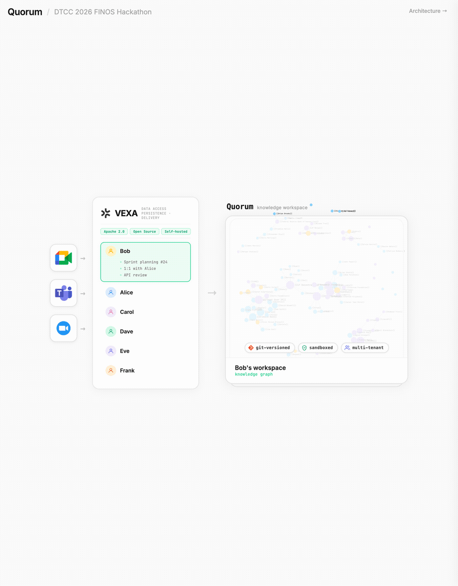
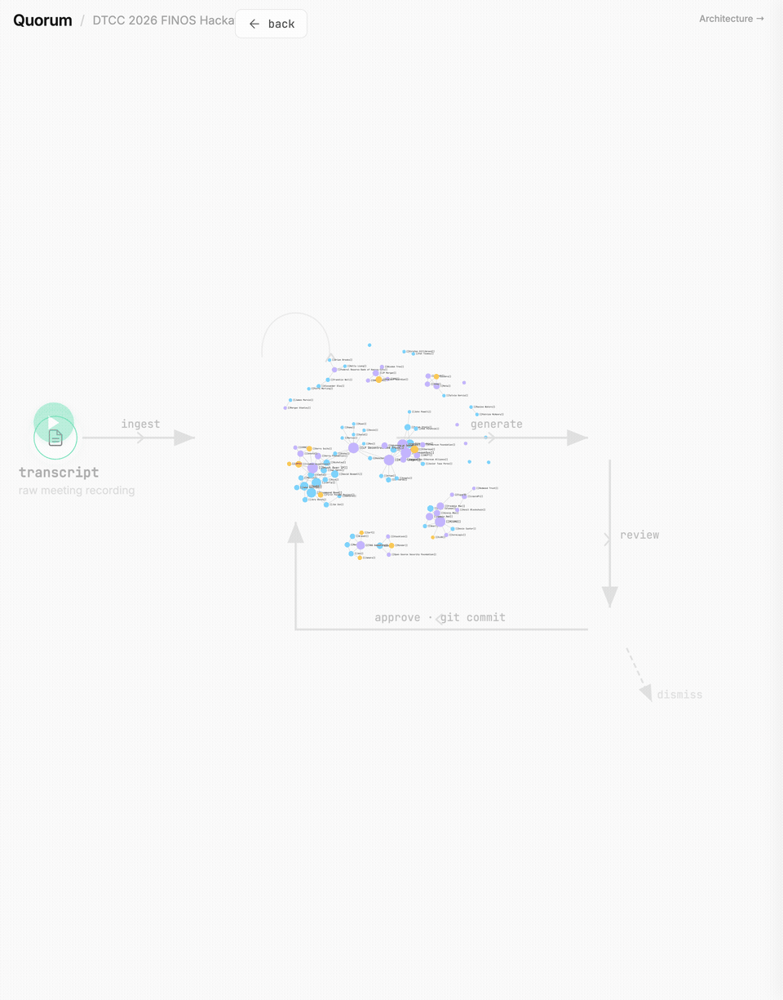
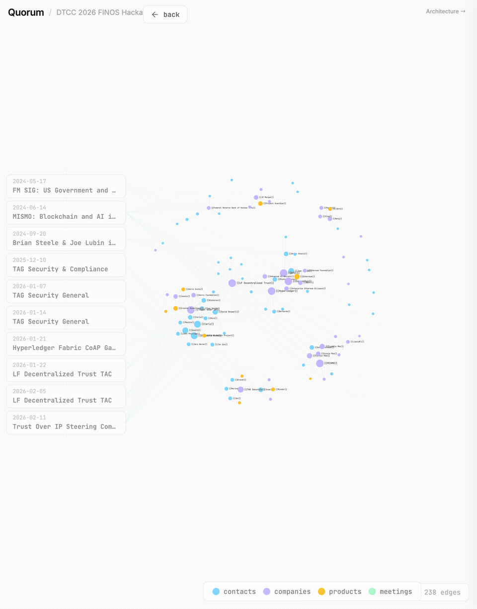
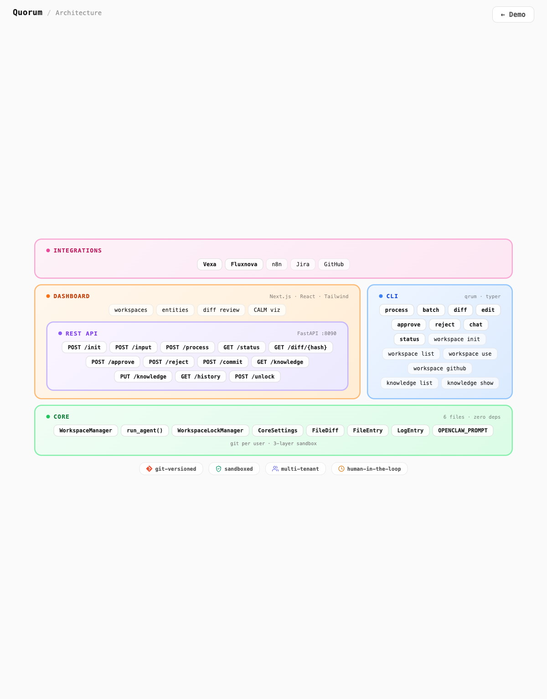

# Quorum — Presentation

**Team Skynets Interns | DTCC 2026 FINOS Hackathon**

> **[Try the interactive presentation](https://finos-labs.github.io/dtcch-2026-skynets-interns/presentation/graph.html)** — a 3-level zoom-in webapp. Click to explore.

---

## The Problem

Every organization runs meetings. Most of that knowledge **evaporates**.

Minutes are static, disconnected, never referenced again. Next meeting — same introductions, same context-setting, same lost threads. Institutional knowledge doesn't compound. **It decays.**

---

## The Solution — Quorum

**Transcript in → AI agent reads it against your *entire* approved history → generates structured artifacts → human reviews the diff → approved output commits to git → next meeting gets all prior context.**

The knowledge compounds. That's the whole point.

---

## How It Works

The presentation is an interactive 3-level zoom into Quorum's architecture. Each level reveals more detail.

### Level 1 — Data Sources

Meetings from any platform (Google Meet, Teams, Zoom) flow through [Vexa](https://github.com/Vexa-ai/vexa) (open-source, Apache 2.0) into each user's isolated Quorum workspace.



Each user gets their own **git-versioned, sandboxed, multi-tenant** knowledge workspace. Click a user to see their meetings. Click the workspace to zoom in.

---

### Level 2 — Processing Pipeline

Inside the workspace, every meeting follows the same loop:



1. **Ingest** — raw transcript enters the workspace
2. **Generate** — an AI agent (Claude Code, Codex, or OpenClaw) reads the transcript *plus the entire accumulated knowledge base* and produces structured artifacts
3. **Review** — artifacts become structured diffs for human inspection
4. **Approve** — human accepts → `git commit` → knowledge base grows. Or dismisses → `git revert`
5. **Repeat** — next meeting gets richer context. The system compounds.

**The key insight:** human review before persistence means Meeting N+1 always builds on *clean*, validated data from meetings 1 through N.

---

### Level 3 — Entity Graph

Zoom into the knowledge base itself: a living graph of everything the system has learned.



**99 entities · 10 meetings · 238 edges**

From 10 real FINOS/LF Decentralized Trust governance meetings, Quorum automatically discovered and cross-referenced:
- **55 contacts** — people, their roles, affiliations
- **36 organizations** — companies, working groups, foundations
- **Products & standards** — Hyperledger, Ethereum, SWIFT, CALM

Each entity profile accumulates context over time. By meeting 10, the agent has institutional memory — not hallucinated, not assumed, but **reviewed and committed by a human**.

---

## What It Generates

| Artifact | Description |
|----------|-------------|
| **Minutes** | Executive summary, `DECISION:` markers, key quotes, per-topic outcomes |
| **Action Items** | Assigned owner, confidence level, labels, deadlines |
| **Entity Profiles** | Contacts, companies, products — created or updated across meetings, wiki-linked |
| **CALM Architecture** | FINOS standard architecture-as-code JSON — generated when architecture is discussed |

---

## Architecture



**Core** is the engine: 6 files, zero external dependencies.

| Layer | Tech |
|-------|------|
| **Integrations** | Vexa, Fluxnova, n8n, Jira, GitHub |
| **Dashboard** | Next.js, React, Tailwind |
| **REST API** | FastAPI :8090 — 12 endpoints |
| **CLI** | `qrum` · typer |
| **Core** | 6 files · zero deps · git per user · 3-layer sandbox |

**Git is the persistence layer.** Process = commit. Review = diff. Approve = push. Reject = revert. Full history, full auditability.

---

## The Research Behind It

We didn't guess at what good meeting minutes look like. **We studied them.**

**1,343 real governance meeting minutes** from 10 open-source organizations:

| Source | Files |
|--------|-------|
| Node.js TSC | 389 |
| OpenJS Cross-Project Council | 213 |
| TC39 (JavaScript Standards) | 176 |
| Electron Governance | 163 |
| GraphQL WG, OpenSSF TAC, W3C, Hiero TSC, LF DT TAC, K8s SIG-Release | 402 |

From this corpus we derived universal patterns and curated **50 gold-standard minutes** for benchmarking.

---

## Knowledge Accumulation — "Watch It Get Smarter"

| Meeting | What happens |
|---------|--------------|
| **Meeting 1** | Generic output — the agent knows nothing |
| **Meeting 5** | Recognizes Brian Steele (DTCC), knows what DvP means, tracks recurring participants |
| **Meeting 10** | Rich cross-referenced output — 122 files, 55 contacts, 36 orgs, entity profiles linked across meetings |

The agent even updates its own instructions with learned context — domain abbreviations, recurring participants, org structures — so future runs benefit automatically.

---

## Three Technical Differentiators

1. **Git-native** — every artifact is versioned, diffable, reversible. No black box database. Review knowledge the same way you review code.

2. **Agent-agnostic** — currently Claude Code with scoped permissions. Drop-in replaceable with Codex, OpenClaw, or any CLI-based LLM agent.

3. **FINOS technologies** — CALM architecture-as-code standard for system diagrams. Built for open governance.

---

## What We Built vs. What We Leveraged

| Leveraged | Built for Hackathon |
|-----------|---------------------|
| **Vexa** — transcription, auth, user management | **Core engine** — workspace manager, agent runner, prompts (6 files, zero deps) |
| **Vexa Dashboard** — base UI (git subtree) | **Prompt engineering** — analyzed 1,343 real minutes from 10 orgs |
| | **Knowledge accumulation** — agent reads all prior knowledge, updates its own instructions |
| | **Dashboard extensions** — review panel, entities library, CALM visualizer |
| | **CLI (`qrum`)** — full terminal workflow, no server needed |
| | **GitHub integration** — approve = push to remote |
| | **Demo dataset** — 10-meeting chain showing compound knowledge |

---

## Try It

```bash
pip install -e .
qrum workspace init demo
qrum process data/sample-meetings/meeting1.txt -t "First Meeting"
qrum diff          # review what the agent generated
qrum approve       # accept → knowledge base grows
qrum chat "What did we discuss?"
```

Or explore the **[interactive presentation](https://finos-labs.github.io/dtcch-2026-skynets-interns/presentation/graph.html)**.

---

*Team Skynets Interns — Dmitriy Grankin*

*GitHub: [finos-labs/dtcch-2026-skynets-interns](https://github.com/finos-labs/dtcch-2026-skynets-interns)*
